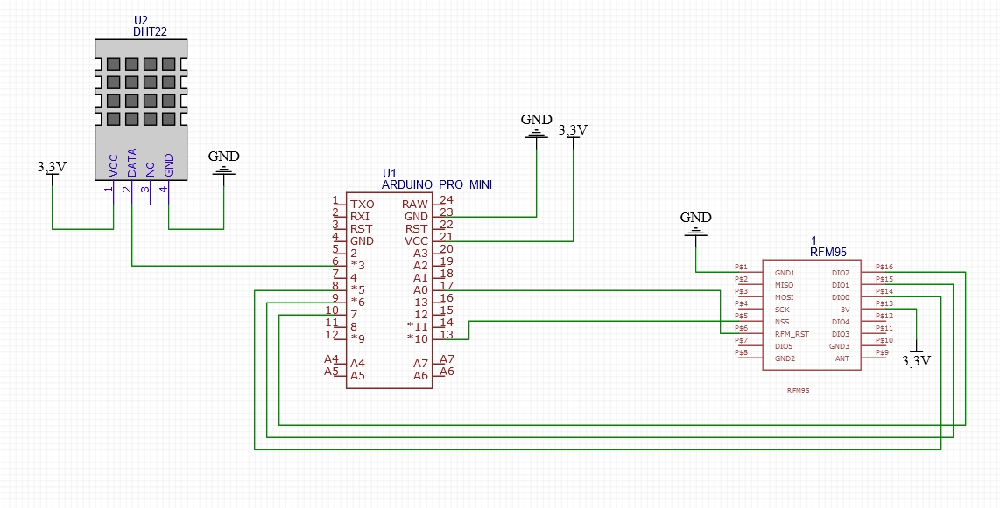
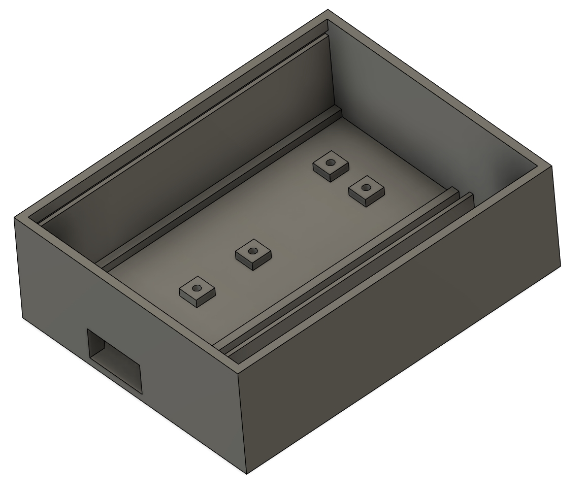
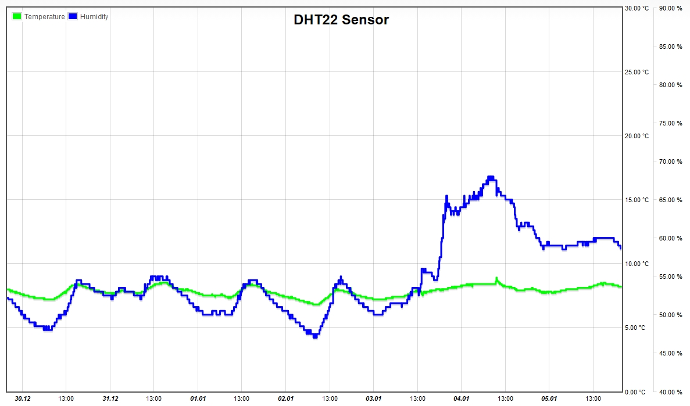
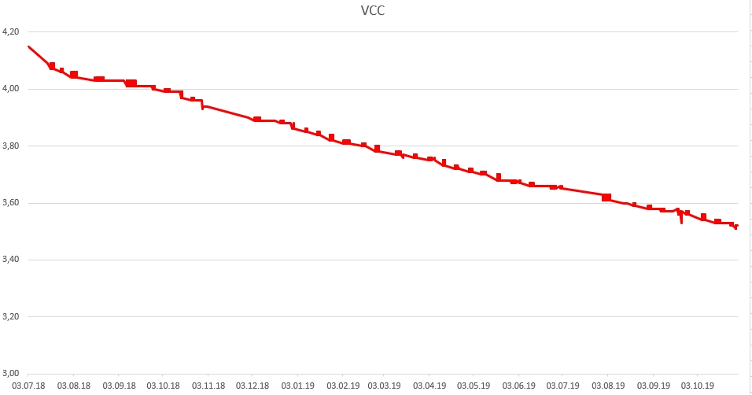

# Arduino Pro Mini TTN LoRaWAN sensor node

`Arduino Pro Mini` TTN LoRaWAN Node with `DHT22` and `RFM95` module powered by an 18650 protected battery.  
The Arduino was converted to LowPower by desoldering the power LED and the voltage converter.

## Circuit




## Case



## Diagrams 


### Battery voltage curve over 12 months with measure and send data all 5 minutes



## TTN payload decoder

```javascript
function Decoder(bytes, port) {
  var decoded = {};
  
  decoded.vcc = (bytes[0] + 200)/100;
  
  if(bytes[1] != 255){
    decoded.humidity = bytes[1]; 
    decoded.humidity &= ~(1 << 7);
    if(bytes[1] >> 7 == 1) { decoded.humidity +=0.5 }
  }
  
  if(bytes[2] != 255 || bytes[3] != 255) decoded.temperature = ((bytes[2]<<24>>16 | bytes[3]) / 10);
  return decoded;
}
```

